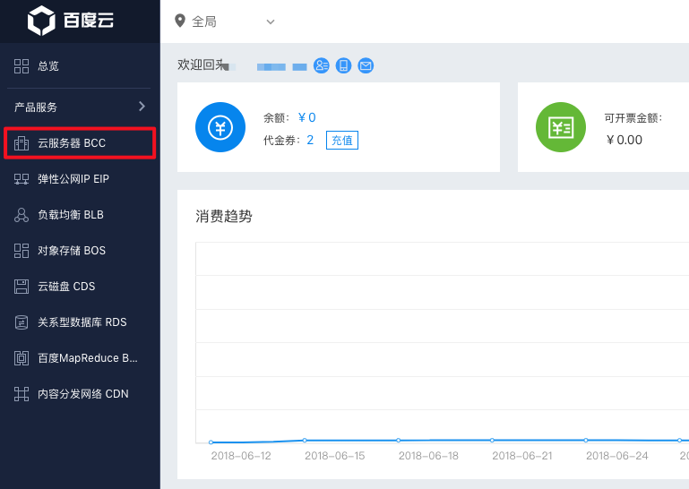
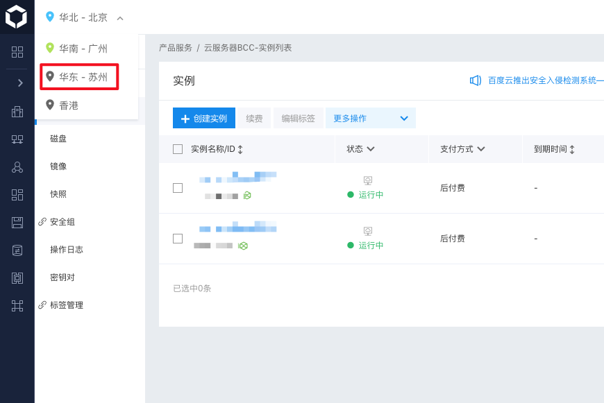
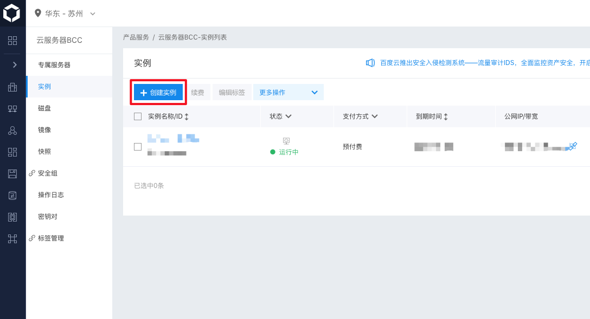
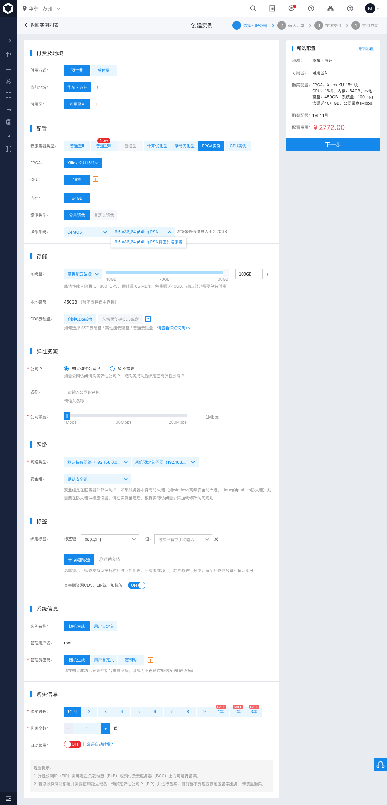
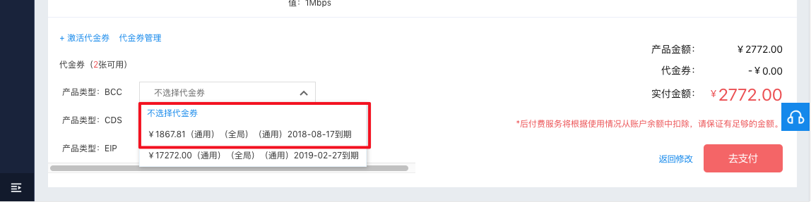
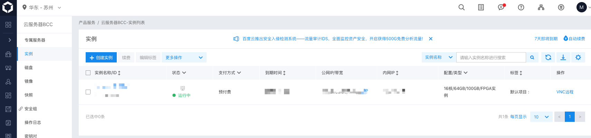
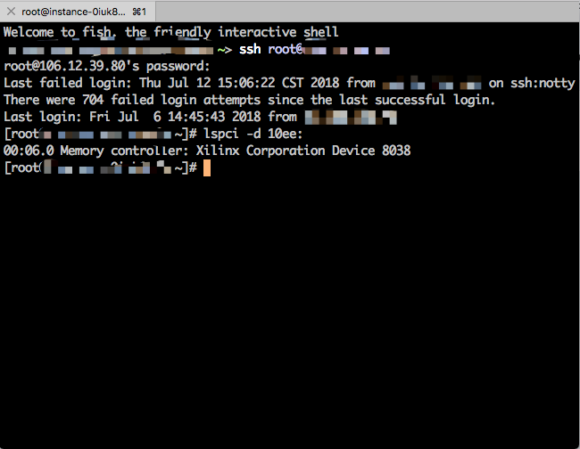

# 1. 购买比赛专用AI加速器BCC实例

使用百度账号登录[百度云](https://login.bce.baidu.com/?account=)。

选择左侧边栏“云服务器BCC”。

点击左上方下拉列表切换到“华东-苏州”地域。

点击“实例”选项卡中的“创建实例”按钮。

按图示配置购买AI加速器BCC实例，**注意操作系统需选择“6.5 x86_64 (64bit) RSA解密加速服务”**。同时购买一个公网IP，以便于从本地终端连接至购买的BCC实例。如创建实例时选择了“随机生成管理员密码”，则BCC实例的root密码稍后会发送至百度云绑定的手机上。

使用代金券支付产生的费用。

稍等一段时间，可以在“实例”选项卡中看到刚才创建的BCC实例。

使用公网IP和随机密码从本地终端登录至BCC实例，通过`lspci -d 10ee:`可以查看到BCC实例中附带的FPGA。

